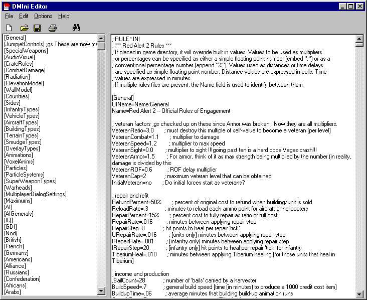



## A Real Good Ini Editor

### Description

This is a Ini editor I made, it has many functions and is especially handy for editing the rules.ini file from Red Alert2.
 
### More Info
 

             |
---                |---
**Submitted On**   |2001-07-28 10:35:52
**By**             |[Dennis Meelker](https://github.com/Planet-Source-Code/PSCIndex/blob/master/ByAuthor/dennis-meelker.md)
**Level**          |Intermediate
**User Rating**    |4.5 (18 globes from 4 users)
**Compatibility**  |VB 4\.0 \(16\-bit\), VB 4\.0 \(32\-bit\), VB 5\.0, VB 6\.0
**Category**       |[Complete Applications](https://github.com/Planet-Source-Code/PSCIndex/blob/master/ByCategory/complete-applications__1-27.md)
**World**          |[Visual Basic](https://github.com/Planet-Source-Code/PSCIndex/blob/master/ByWorld/visual-basic.md)
**Archive File**   |[A Real Goo236637282001\.zip](https://github.com/Planet-Source-Code/dennis-meelker-a-real-good-ini-editor__1-25599/archive/master.zip)

